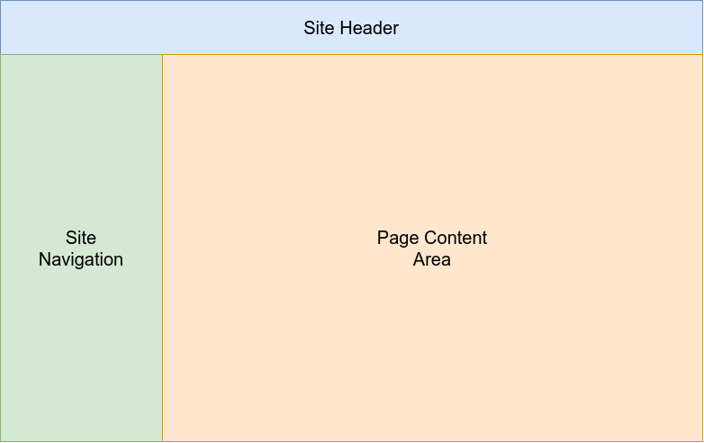

For your backend to work with Centurion UI, you must describe not only your data, but how you wish for it to be displayed.

The following parts of the UI require descriptions:

- UI Routes

- Navigation

- Data fields

- Data layout

As long as these items are described, the UI will display your backend data as per your descriptions. Additionally, every time you update your backend, you must add / update / remove any descriptions as necessary.

The formats of these descriptions can be found in the [API documentation](./api/index.md#description). All descriptions are in `json`.

!!! note
    The API documentation is documentation on the actual code objects. When viewing the descriptions, take the following into account so as to assist in mapping a `javascript` code object to a `json` object.

    - An Interface should be considered a `json` dictionary
    
    - An Object should be considered a `json` dictionary

    - A Type should be considered a `json` type based off of what ever the type defines.

    - All other types as written should match the `json` types.

## Assumptions

It is assumed that you already know what a `json` document is. If you do not, as it is outside of the scope of this documentation. You must learn it first. All descriptions that your backend supplies, must be valid `json` documents and with the correct structure as defined within this documentation.

## UI Areas

For ease of documenting and explaining how to describe the UI, it has been broken down into the following areas:

_Fig 1. Different areas of the UI._

- `Site Header` is where the website name / logo is displayed as well as different tools.

- `Site Navigation` This is where the links for the navigation will be displayed.

- `Page Content` This area is where the data from the backend will be displayed.

All descriptions for the "Site" areas are obtained via a single [apiRootMetadata](./api/apiRootMetadata/index.md) request to the backend. Whereas the "Page Content" descriptions are obtained via an [apiMetadata](./api/apiMetadata/index.md) request to the backend whenever the user navigates.

### UI Routes

UI [Routes description](./api/RouteDescription/index.md) is used to inform the UI what layouts are required for each path of the navigation. It is this description that defines what actual [layout(s)](./api/RouteComponentDescription/index.md) will be used to display your data.

### Site Navigation

[Navigation description](./api/NavigationEntryDescription/index.md) is what is used to create the navigation menu that the user will see.

### Page Content

The page content area does not have a single description. However what must be described for this area is the data and it's structure. What description you use is dependent upon what ever  [route layout](./api/RouteComponentDescription/index.md) was chosen. The UI fetches these descriptions in an [apiMetadata](./api/apiMetadata/index.md) request on the backend the data is being obtained from.
